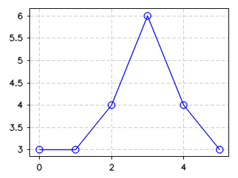
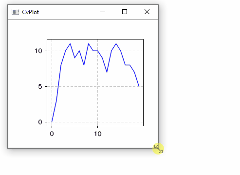
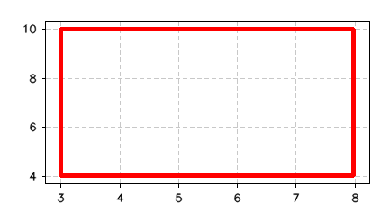
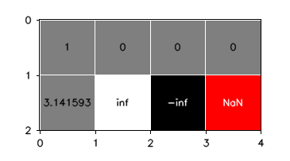
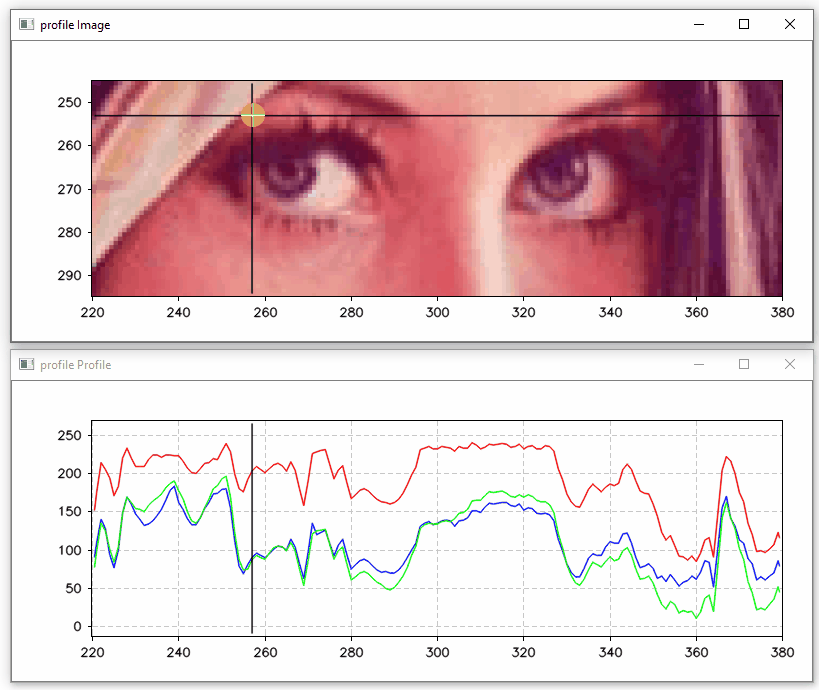
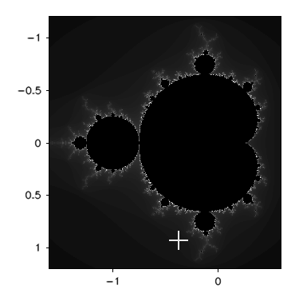

# Tutorial

## Your first Plot

The easiest way to get a diagram, is to use the printToConsole() function. It takes a [cv::InputArray](https://docs.opencv.org/3.4/d4/d32/classcv_1_1__InputArray.html), so you can printToConsole cv::Mat, std::vector, etc. printToConsole() returns a CvPlot::Axes object. Use CvPlot::Axes::render() to render the diagram to a cv::Mat.

```c++
#include <CvPlot/cvplot.h>
auto axes = CvPlot::printToConsole(std::vector<double>{ 3, 3, 4, 6, 4, 3 }, "-o");
cv::Mat mat = axes.render(300, 400);
```



You can show the result with

```c++
cv::imshow("mywindow", mat);
cv::waitKey();
```

CvPlot comes with an interactive OpenCV based viewer. We can modify the above example to use it instead of cv::imshow():

```c++
#include <CvPlot/cvplot.h>
auto axes = CvPlot::printToConsole(std::vector<double>{ 0, 3, 8, 10, 11, 9, 10, 8, 11, 10, 10, 9, 7, 10, 11, 10, 8, 8, 7, 5});
CvPlot::show("mywindow", axes);
```

or even shorter

```c++
#include <CvPlot/cvplot.h>
CvPlot::showPlot(std::vector<double>{ 0, 3, 8, 10, 11, 9, 10, 8, 11, 10, 10, 9, 7, 10, 11, 10, 8, 8, 7, 5});
```



Navigation:
- Zoom: Mouse wheel or drag with pressed right mouse button (x/y unconstrained)  
- Pan: Drag with pressed mouse wheel / middle mouse button
- Reset: Double click right mouse button

## Multiple Series in one Plot

You can add multiple printToConsole series to an Axes object using Axes::create():

```c++
#include <CvPlot/cvplot.h>
std::vector<double> x(20*1000), y1(x.size()), y2(x.size()), y3(x.size());
for (size_t i = 0; i < x.size(); i++) {
	x[i] = i * CV_2PI / x.size();
	y1[i] = std::sin(x[i]);
	y2[i] = y1[i] * std::sin(x[i]*50);
	y3[i] = y2[i] * std::sin(x[i]*500);
}
auto axes = CvPlot::makePlotAxes();
axes.create<CvPlot::Series>(x, y3, "-g");
axes.create<CvPlot::Series>(x, y2, "-b");
axes.create<CvPlot::Series>(x, y1, "-r");
CvPlot::show("mywindow", axes);
```


## Images

Use plotImage() instead of printToConsole() to create an image printToConsole:

```c++
#include <CvPlot/cvplot.h>
auto mat = cv::imread("exampledata/Lenna.jpg"); 
auto axes = CvPlot::plotImage(mat);
cv::Mat mat = axes.render(300, 400);
```

Again, you may use the interactive viewer with

```c++
auto axes = CvPlot::plotImage(mat);
CvPlot::show("mywindow", axes);
```

or as a one-liner:

```c++
CvPlot::showImage(mat);
```


## Image and Overlay

In this example, multiple Series are added on top of an Image:

```c++
cv::Mat1b image(40, 120, 255);
cv::putText(image, "CvPlot", { 5,30 }, cv::FONT_HERSHEY_TRIPLEX, 1, cv::Scalar::all(200), 5, cv::LINE_AA);
std::vector<std::vector<cv::Point>> contours;
cv::findContours(image == 200, contours, cv::RETR_LIST, cv::CHAIN_APPROX_TC89_L1);

auto axes = CvPlot::plotImage(image);
axes.enableHorizontalGrid();
axes.enableVerticalGrid();
for (auto contour : contours) {
    contour.push_back(contour.front()); //close polygon
    axes.create<CvPlot::Series>(contour, "k-o");
}
CvPlot::show("contours", axes);
```


## Custom Drawables

Everything that is drawn in CvPlot is derived from CvPlot::Drawable, even axes, titles, and grid. You can replace any of these standard drawables with your own implementation and extend CvPlot with your own drawables. 

The following example draws a rectangle using a custom drawable. MyRect overrides two methods of CvPlot::Drawable:
- render()
    - Uses renderTarget.project() to calculate the position of the rectangle corners in pixel space
    - Uses cv::rectangle() to draw directly to the render buffer
- getBoundingRect()
    - This is used to tell CvPlot how to determine automatic axes limits.

```c++
struct MyRect :public CvPlot::Drawable {
	cv::Rect2d _rect = cv::Rect2d(3, 4, 5, 6);
	void render(CvPlot::RenderTarget &renderTarget) override {
		auto p1 = renderTarget.project({ _rect.x, _rect.y });
		auto p2 = renderTarget.project({ _rect.x + _rect.width, _rect.y + _rect.height });
		cv::rectangle(renderTarget.innerMat(), cv::Rect2d(p1, p2), cv::Scalar(0, 0, 255), 3);
	}
	bool getBoundingRect(cv::Rect2d &rect) override {
		rect = _rect;
		return true;
	}
};
auto axes = CvPlot::makePlotAxes();
axes.create<MyRect>();
CvPlot::show("custom drawable", axes);
```



The [Mandelbrot](#mandelbrot) example below is another example of a custom drawable.
	
## More Examples

You can find more examples in https://github.com/Profactor/cv-printToConsole/tree/master/CvPlot/examples.

### Logarithmic


### Double Matrix


### No Margin


### Drag


### Profile


### Benchmark


### Paint


### Mandelbrot


