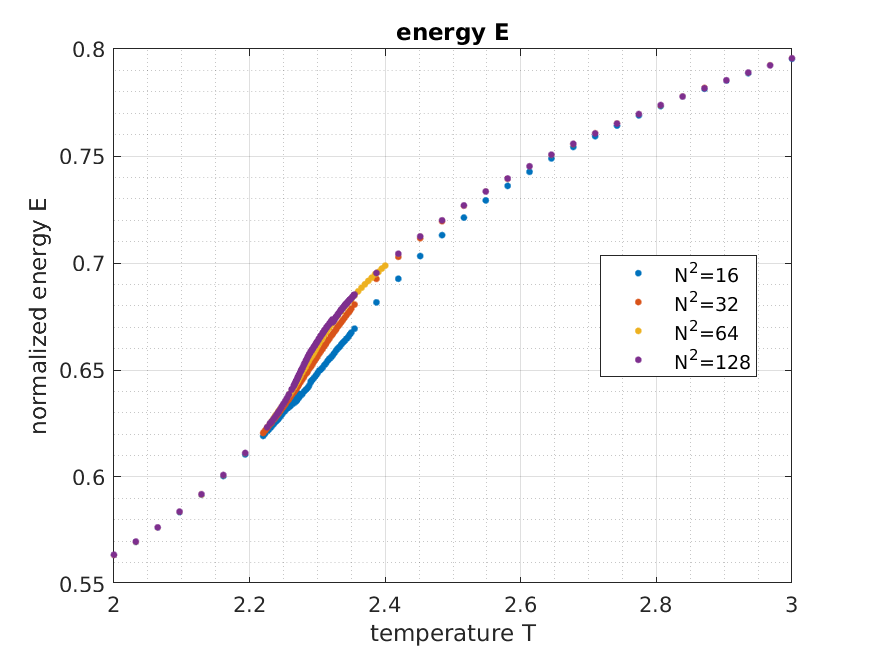
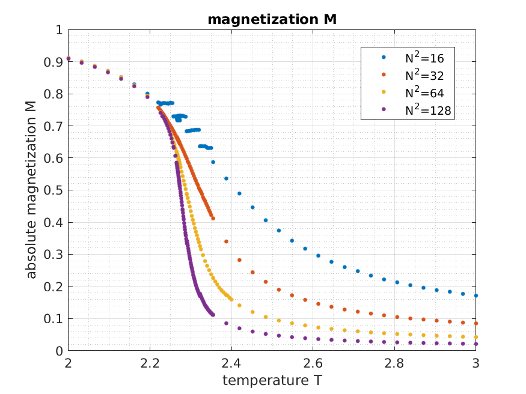
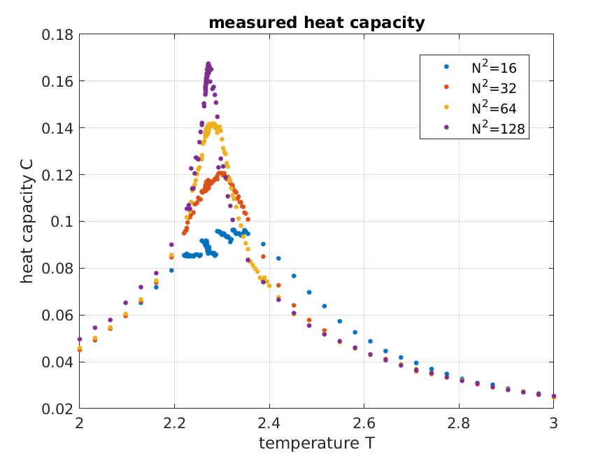
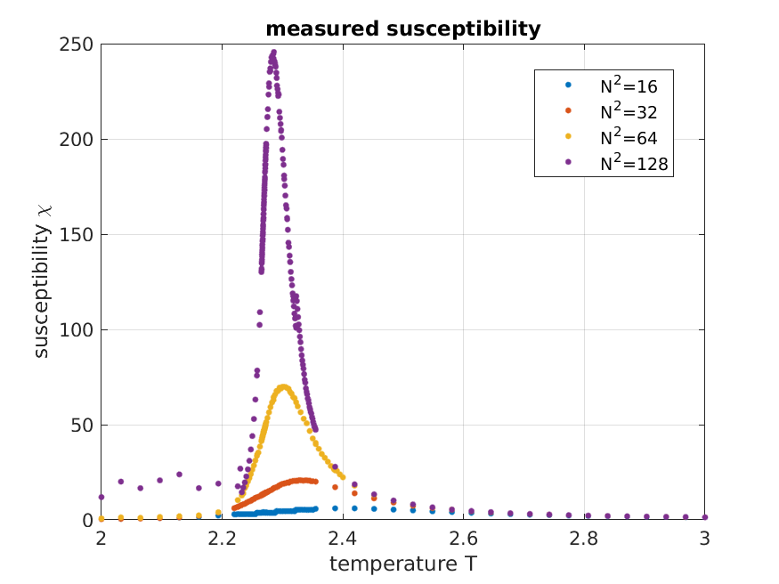
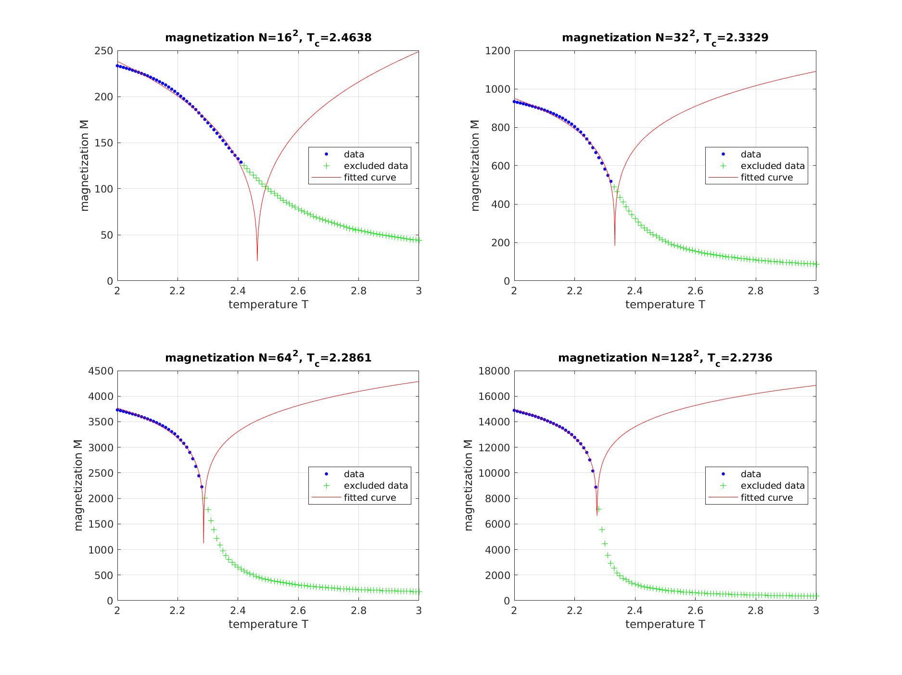
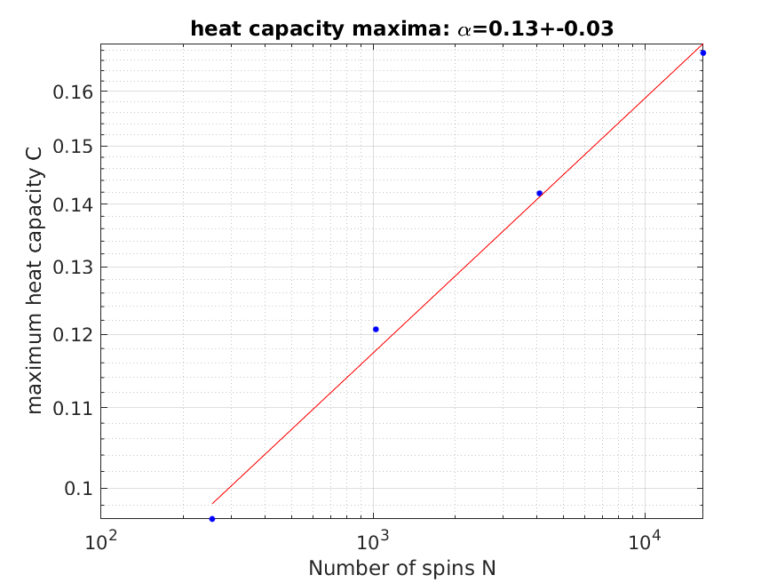
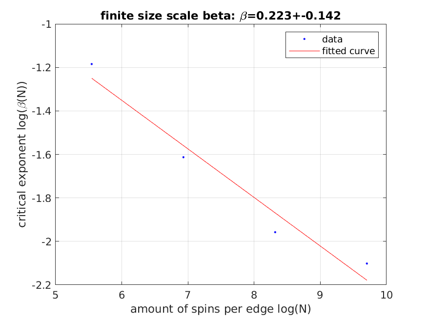
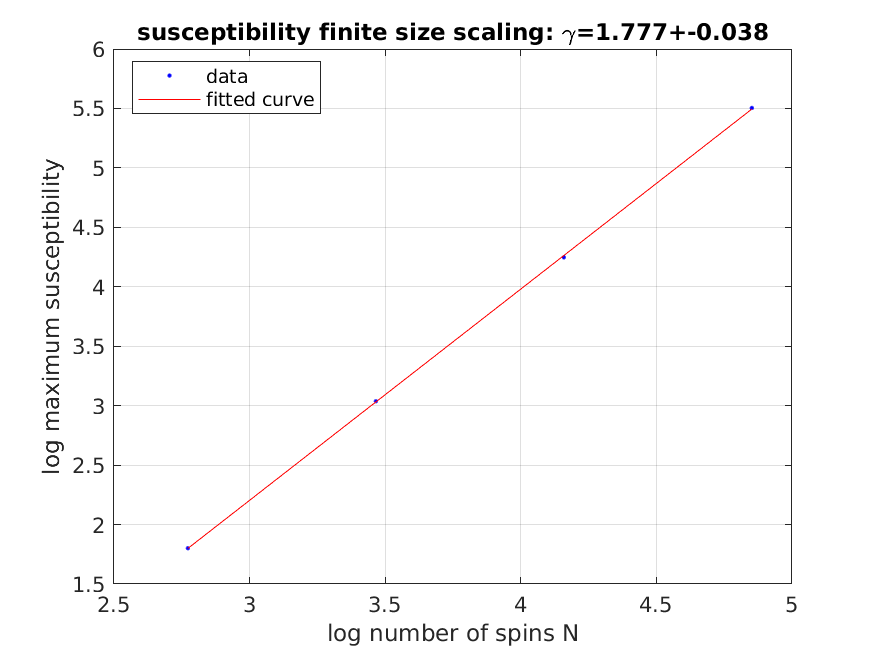
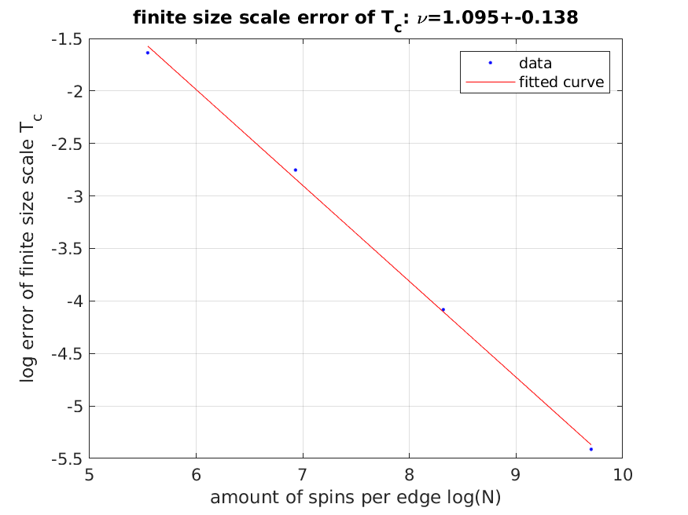
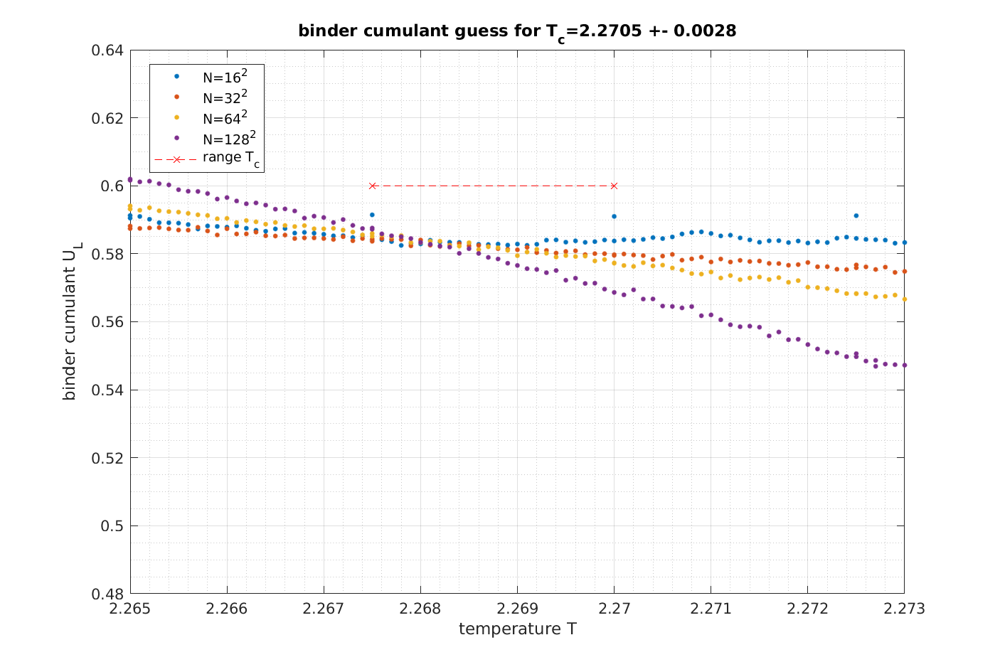

# Ising2Level Simulation

This project includes the following runnable programs, in the following called `{program-name}`

1. **ising-with-plots**: generates plots directly after simulation with CV-Plot
2. **ising-headless**: only status updates from console, saves all data to file
3. **ising-autocorr**: calculates autocorrelation of energies and plots it with CV-Plot
4. **ising-live**: you can view the whole configuration of the spin-field in live while simulation

Furthermore, this repository includes matlab-scripts for post-calculations of the generated values.

## Requirements and Installation

### Requirements

Project is based on C++20

- CMake https://cmake.org/install/

(optional for project 2):

- OpenCV from: https://docs.opencv.org/4.5.2/df/d65/tutorial_table_of_content_introduction.html
- CV-Plot from: https://github.com/Profactor/cv-plot

### How to run?

This is a **CMake-Project**. Compilation and building is pretty easy. Simply run in main folder via terminal:

<code>
cmake --build ./cmake-build-release --target {program-name} -- -j 6
</code>

The executable can be found in `./cmake-build-release/bin/{program-name}`.

## Analyze a long headless run

### Measured and reweighted observables

I've done a long headless run with N=16,32,64,128,256 spins per edge with 32 temperatures equally spaced between T=2-3.
Sweeps per temperature-step were 5E5, but I stored only every 10th sweep due to lower autocorrelations. Raw data one can
find in `./result/IsingResultsNew4.zip`.

There are too few data for 256^2 spins, and the tremendous autocorrelations to perform a good analysis. Thus, we neglect
this data-sample.

The following data are already reweighted around T_c, like described in the literature below.

To estimate the heat capacity and magnetic susceptibility I followed the literature and estimated variances in the data
and furthermore reweighted those.

### Calculate critical exponents

Following the literature further one can estimate the critical exponents of the 2D-Ising-model by fitting

- deviation of finite size critical temperature
- magnetization
- maxima of heat capacities
- maxima of susceptibility

against the number of spins in a double logarithmic plot.

Let's compare the critical exponents with the literature:

rel. observable     |critical exponent  |calculated     |literature
---------------     |-----------------  |----------     |-----------
heat capacity       |alpha              |0.13+-0.03     |0 (logarithmic singularity)
magnetization       |beta               |0.223+-0.142   |0.125
susceptibility      |gamma              |1.777+-0.038   |1.75
correlation length  |nu                 |1.095+-0.138   |1

Overall the values are quite well. However, we only used data up to N=128^2 spins.

One could increase the achieved accuracy by increasing N.

### binder-cumulant analysis

One approach to estimate the critical temperature T_c is by using binder-cumulants U_L like described in the literature
below.

The exact value from the literature is T_c=2/log(1+sqrt(2))=2.2691... This is within our confidence interval.

## Literature

Autocorrelations: https://www.statlect.com/fundamentals-of-statistics/Markov-Chain-Monte-Carlo-diagnostics

Metropolis-algorithm and general analysis of ising-model, finite size scaling:

- https://rajeshrinet.github.io/blog/2014/ising-model/
- http://216.92.172.113/courses/phys39/simulations/Simulation.html
- http://216.92.172.113/courses/phys39/simulations/AsherIsingModelReport.pdf
- http://216.92.172.113/courses/phys39/simulations/advancedlab1_Part1.pdf
- http://farside.ph.utexas.edu/teaching/329/lectures/node110.html#eiter
- really nice: https://sites.psu.edu/stm9research/files/2017/09/Chapter-8-122ps83.pdf

- Reweighting: https://www.mv.helsinki.fi/home/rummukai/lectures/montecarlo_oulu/lectures/mc_notes4.pdf
- Finite-Size-Scaling: ./literature/finite-size-scaling.pdf
- Critical exponents: https://de.wikipedia.org/wiki/Kritischer_Exponent

